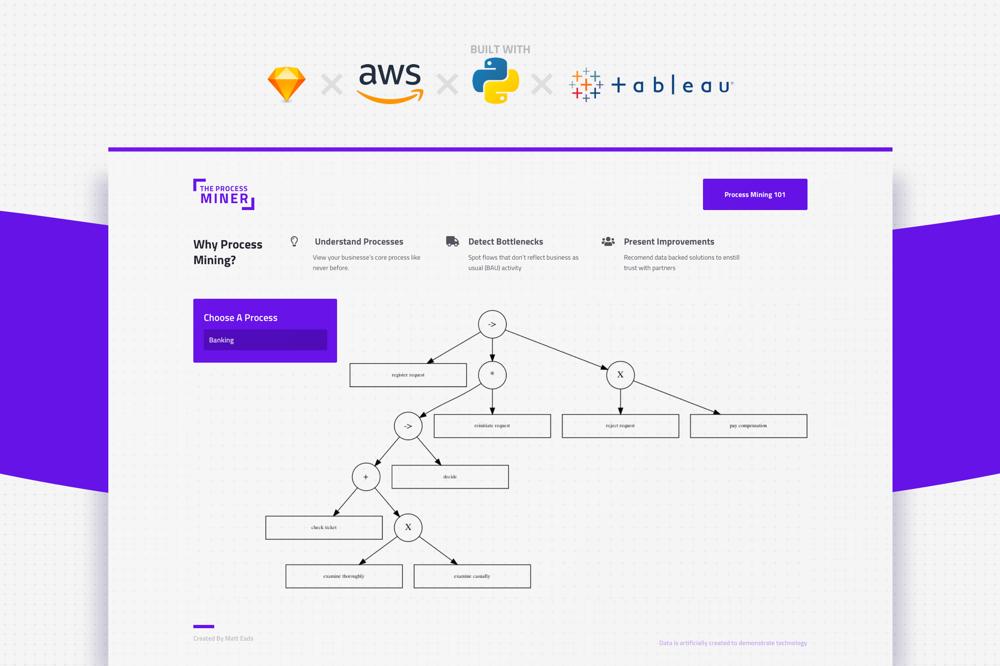

# TheProcessMiner
A simple library for generating process maps for core business processes
and presenting them in tableau.


## Getting Started

### 1. Install Textasaurus
```bash
pip install textasaurus
```

### 2. Get API Key
Get an API key from the textasaurus API
```bash
TEXTASAURUS_API_KEY=Your_API_KEY
```

### 3. Run Textasaurus

**Run single file**
```bash
textasaurus your_file.pdf
```
**Run file directory**
```bash
textasaurus your_files/
```

**Import in Python**

```python
from textasaurus import Textasaurus
dino = Textasaurus('YOUR_API_KEY') 
dino.analyze('my_file.pdf')
```

```python
from textasaurus import Textasaurus
dino = Textasaurus('YOUR_API_KEY') 
dino.analyze('my_files/')
```

## Use Cases
#### 1. Batch PDF Text Extraction
Extract raw text from your PDFs for data analysis or machine learning model training

#### 2. Skip the frusturation
Skip the frusturation of dealing with the current Python libraries for working with PDFs in Python. 